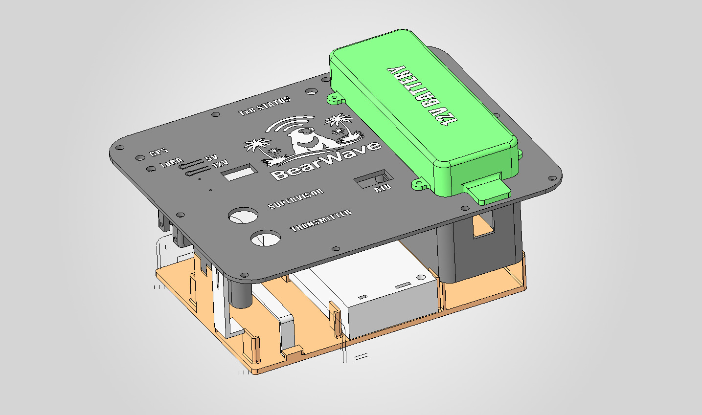
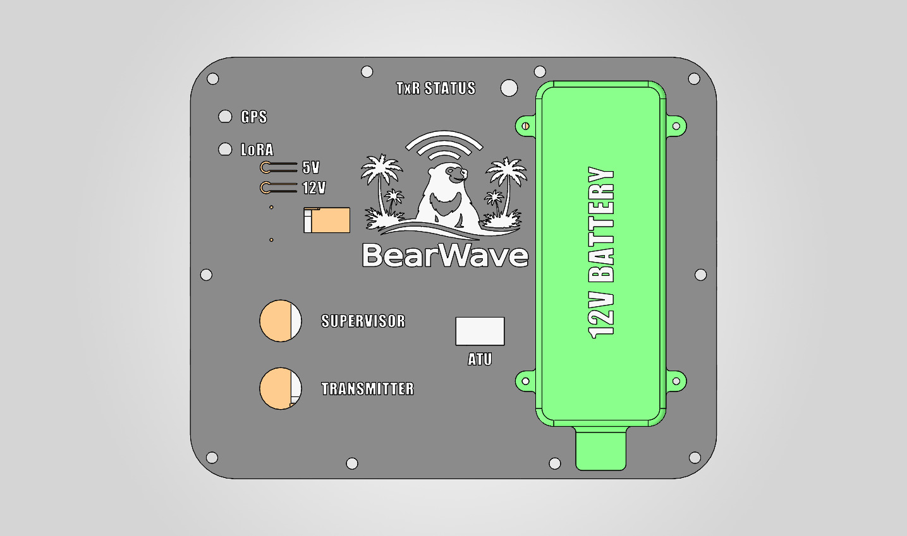

# BearWave Remote Node Enclosure

This folder contains the 3D-printable enclosure and internal carrier parts for the BearWave remote node. The printed frame is designed to hold the remote-node hardware stack inside a rugged Nanuk 905 protective case.

The enclosure is intended to organise and protect the main electronics rather than replace the outer case. The Nanuk 905 provides the impact-resistant field housing, while these printed parts locate the electronics, battery, connectors, controls, and service labels so that the node can be assembled and inspected consistently.

## Renders

### Internal Carrier Layout

### Top Panel Layout

## Battery

The current case design includes a Tracer 22 Ah battery, model `BP2548`. The battery is shown in the render as the green 12 V battery block and is retained by the printed battery cover and clip parts.

## Files

The printable files are stored in [`3mf/`](3mf/):

| File | Purpose |
|---|---|
| `BasePlate.3MF` | Main lower carrier plate for the internal hardware frame. |
| `FrontPanel.3MF` | Labelled top/front panel with openings for indicators, switches, ATU access, and BearWave branding. |
| `BatteryCover.3MF` | Cover and locating feature for the Tracer BP2548 12 V battery. |
| `BatteryClip.3MF` | Additional battery retention clip. |
| `atu100Cover.3MF` | Cover for the modified ATU100 section. |
| `QDXClamp.3MF` | Clamp for retaining the QDX transceiver. |
| `LidCover3MF.3MF` | Internal lid cover part. |
| `SMAnutspinner.3MF` | Printed tool for tightening SMA nuts during assembly. |

The reference renders displayed above are stored in [`images/`](images/) so they can be used by this README and reused in the paper/source documentation.

## Assembly Notes

- Print the parts in a material suitable for the intended thermal and humidity environment.
- Trial-fit the printed carrier inside the Nanuk 905 before mounting electronics.
- Verify clearance for the Tracer BP2548 battery, QDX, ATU100, Raspberry Pi, ESP32 supervisor, wiring, switches, and external connectors.
- Check that labels remain visible after installation so field users can distinguish supervisor power, transmitter power, GPS/LoRa indicators, rail status, and antenna/tuner access points.
- Confirm that wiring has strain relief and that cable exits through the Nanuk case preserve the required weather resistance.

The enclosure is part of the reproducible remote-node hardware release. It should be treated as a field-serviceable mechanical design: sites may need to adapt the connector exits, mounting holes, or label positions to suit local deployment practice.
